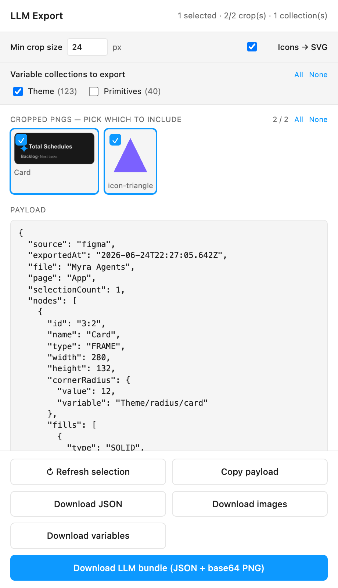

# LLM Export — Figma plugin

Extracts the **current selection** from a Figma file into an **LLM-ready
payload**: compact node JSON (geometry, text, fills, strokes, auto-layout,
component props, **variables inlined on each value**) **plus a rendered image**
of each element — PNG, or **SVG markup** for vectors/icons. Pick which crops and
which variable collections to include, then copy the payload or download the
bundle and feed it to any agent. Wiring a direct "send to agent" call is one
handler away (see [Sending to an LLM](#sending-to-an-llm-later)).

<p align="center">
  
</p>

**Why** — stop pasting screenshots and guessing. An agent doing design-to-code,
design QA, or component work gets the real structure: exact sizes, the design
**token** behind each value (not just the resolved number), the styled text
runs, the effects, and the cropped visuals — all in one JSON it can actually
reason over.

## Payload shape

```jsonc
{
  "source": "figma",
  "exportedAt": "2026-06-24T…Z",
  "file": "My File",
  "page": "Page 1",
  "selectionCount": 2,
  "nodes": [ { "id", "name", "type", "width", "height", "characters", "fills", "strokes",
             "effects", "layout", "layoutSizing", "constraints", "cornerRadius",
             "lineHeight", "letterSpacing", "textCase", "mainComponent", … } ],
  "images": [ { "id", "name", "type", "mimeType": "image/png", "scale": 2, "base64": "iVBORw0K…" } ]
}
```

### Per-element crops

Each meaningful element gets its **own** image cropped to its bounds (the tree
is walked recursively), so an agent can look at pieces, not just the whole frame.

Tick **Icons → SVG** in the toolbar to export vectors and icon-sized elements
(longer edge ≤ 64px) as **SVG markup** instead of PNG — an agent reads `<path>`
data far better than a blurry raster. PNG crops carry base64; SVG crops carry
the raw markup string. The toggle is persisted across reloads.
To avoid a flood of useless slivers, child elements are **skipped** when they
are text/vectors or smaller than a threshold — the layers you explicitly select
are always exported regardless. Tunable at the top of `src/code.ts`:

| const | default | meaning |
|-------|---------|---------|
| `MIN_EXPORT_DIM` | `24` | **default** min crop size — editable live in the UI (**Min crop size** field), persisted across reloads via `clientStorage` |
| `SKIP_EXPORT_TYPES` | `TEXT, VECTOR, LINE, SLICE` | types never cropped standalone |
| `NO_RECURSE_EXPORT` | `INSTANCE` | treated as one atomic block, no crops of internals |
| `MAX_EXPORTS` | `80` | hard cap per run (`meta.truncated` flags when hit) |
| `PNG_SCALE` | `2` | export resolution |

The **Min crop size** field in the plugin re-exports on change and remembers
your value. Elements smaller than it (either dimension) are skipped — except
the layers you explicitly selected, which always export.

The `images[].base64` is drop-in for Anthropic's multimodal content blocks
(`{"type":"image","source":{"type":"base64","media_type":"image/png","data": …}}`).

### Bound variables (inlined)

Variable bindings are inlined **on the value itself**. An unbound property is a
plain value; a bound one becomes `{ value, variable: "Collection/name" }`. This
covers radii (incl. per-corner), colors (fills/strokes), stroke weights,
padding, item spacing, opacity, size, and fontSize:

```jsonc
"cornerRadius": {
  "topLeft":     { "value": 12, "variable": "Theme/radius/card-radius" },
  "topRight":    { "value": 12, "variable": "Theme/radius/card-radius" },
  "bottomRight": 0,
  "bottomLeft":  0
},
"fills": [ { "type": "SOLID", "visible": true,
            "color": { "value": "#181818", "variable": "Theme/card-background" } } ]
```

### Variables export

Every variable the selection references (following alias chains, so it's
self-contained) is also dumped under `variables`, with its type, collection,
and per-mode values (colors as hex, aliases as `{ alias: "Collection/name" }`):

```jsonc
"variables": [
  { "id": "VariableID:…", "name": "radius/card-radius", "type": "FLOAT",
    "collection": "Theme", "valuesByMode": { "Dark": 12, "Light": 12 } },
  { "id": "VariableID:…", "name": "card-background", "type": "COLOR",
    "collection": "Theme", "valuesByMode": { "Dark": "#181818", "Light": "#ffffff" } }
]
```

Only referenced variables are exported by default.

#### Full collection dump (pick collections)

The toolbar lists every local variable **collection** (with its variable
count). Tick the ones you want and they're exported under
`variableCollections`, in Figma's native export-variables shape — one object
per collection (`id`, `name`, `modes`, `variableIds`, `variables[]`), each
variable carrying raw `valuesByMode`, `resolvedValuesByMode` (alias chains
followed, with `alias`/`aliasName`), `scopes`, `hiddenFromPublishing`, and
`codeSyntax`. **All** / **None** toggle the lot. The **Download variables**
button saves **one file per picked collection**, each the bare collection
object — byte-identical to Figma's own variable export (`<Collection>.json`).
With no collection picked it falls back to the referenced subset. Picks persist
across reloads.

## Consume it with Claude Code — the `figma-to-code` plugin

This repo also ships a **Claude Code plugin** that turns an exported payload
into real application code. It's the consumer side of the export: it reads the
node tree, **maps each Figma `variable` to your app's design token instead of
hardcoding the value**, translates auto-layout to flexbox, matches instances to
your existing components, and verifies the result against the exported
screenshot. It bundles a **skill** (in-thread workflow) and a **subagent**
(delegated, isolated conversions) — installed together.

### Install

One line (needs the [Claude Code CLI](https://docs.claude.com/en/docs/claude-code)):

```bash
curl -fsSL https://raw.githubusercontent.com/Gamma-Software/figma-llm-export/main/install.sh | bash
```

Then restart Claude Code (or `/reload-plugins`). The script adds this repo as a
marketplace and installs the plugin via the `claude` CLI — no Node required.
`SCOPE=project` (or `local`) before the command changes the install scope.

<details><summary>Manual install (CLI or in-app)</summary>

```bash
# from any shell:
claude plugin marketplace add Gamma-Software/figma-llm-export
claude plugin install figma-to-code@figma-llm-export

# or inside an interactive Claude Code terminal:
/plugin marketplace add Gamma-Software/figma-llm-export
/plugin install figma-to-code@figma-llm-export
```

The interactive `/plugin` command isn't available in the web/SDK environments —
use the `curl` line or the `claude plugin` CLI there.
</details>

Then export a selection from this Figma plugin, save the payload, and ask:

> implement `topbar.json` in `src/components/…`

Claude invokes the skill automatically (or run `/figma-to-code:figma-to-code`,
or delegate to the `figma-to-code` subagent). The plugin lives under
[`.claude-plugin/`](.claude-plugin/), [`skills/figma-to-code/`](skills/figma-to-code/),
and [`agents/`](agents/); a stdlib-only helper
([`inspect_payload.py`](skills/figma-to-code/scripts/inspect_payload.py)) prints
the token-annotated node tree and extracts the PNG/SVG crops.

It's framework-agnostic (React/Tailwind/shadcn, Vue, plain HTML, SwiftUI, …) and
works best when the Figma file's variable collection mirrors your app's tokens —
then the mapping is near 1:1.

## Develop

```bash
npm install
npm run build      # bundles src/code.ts -> code.js (esbuild)
npm run watch      # rebuild on change
npm run typecheck  # tsc --noEmit
```

`code.js` is generated (gitignored) — run `npm run build` before loading.

## Load in Figma

1. Figma desktop → **Plugins → Development → Import plugin from manifest…**
2. Pick `manifest.json` in this repo.
3. Select layers → **Plugins → Development → LLM Export**.

## Buttons

| Button | Does |
|--------|------|
| ↻ Refresh selection | Re-reads the selection and re-renders PNGs |
| Copy payload | JSON (incl. base64 of **checked** crops) → clipboard |
| Download JSON | Node tree only, images as metadata (no base64) |
| Download PNG(s) | Each **checked** crop as a `@2x` PNG file |
| Download LLM bundle | Full payload incl. base64 of **checked** crops (one file) |

### Picking crops

Every cropped PNG renders as a thumbnail with a checkbox — click to
include/exclude it. **All** / **None** toggle everything; the counter shows
`kept / total`. Only checked crops land in any payload or download. The node
JSON (`nodes`) is always full regardless of crop selection.

## Sending to an LLM later

Currently `networkAccess` is `"none"`. To POST the payload from the plugin:

1. In `manifest.json`, replace `"none"` with the agent domain, e.g.
   `"allowedDomains": ["https://api.anthropic.com"]`.
2. In `ui.html`, add a button that `fetch`es that endpoint with the `payload`
   object (the UI iframe is a real browser context with `fetch`).

Network calls must run in the **UI iframe**, not the sandbox (`code.ts`).
